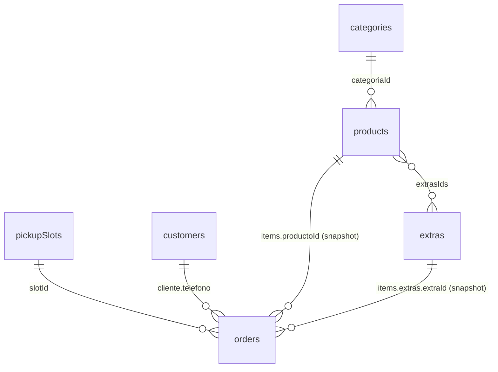
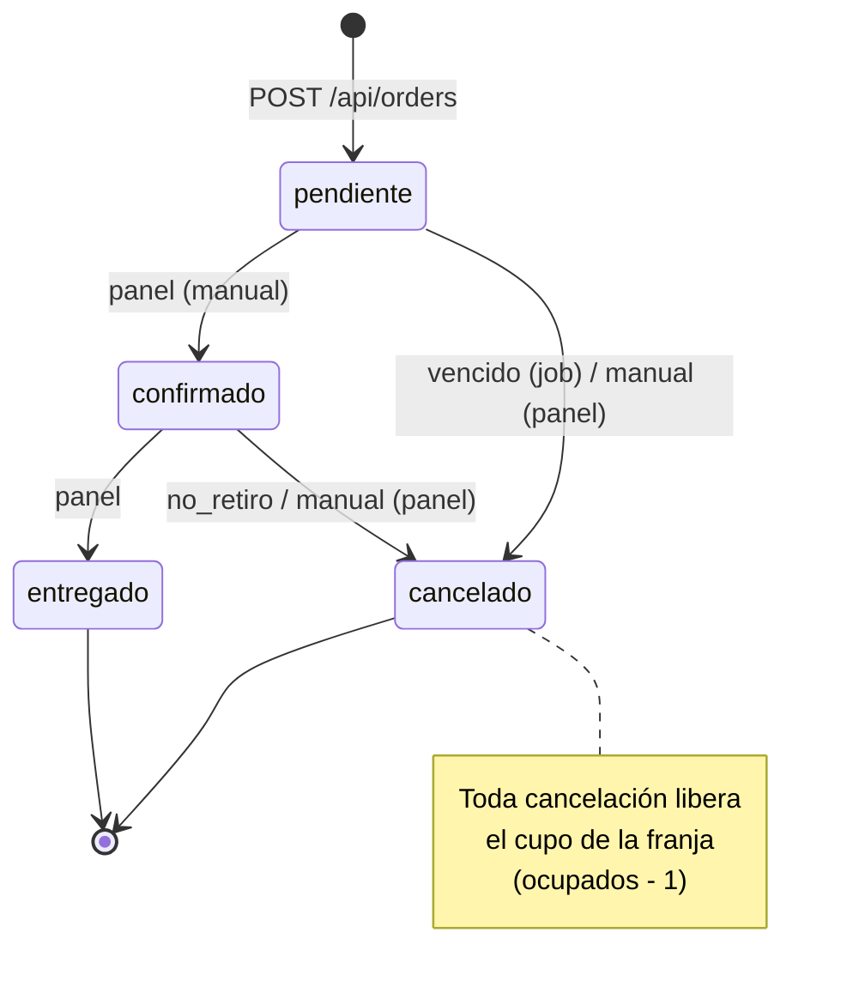

# Black Station — Modelo de datos

Fuente de verdad del modelo de datos, estados, reglas de negocio y endpoints.
Cualquier cambio en schemas, validaciones o contratos de la API se refleja primero acá.

- Base de datos: MongoDB.
- Alcance: colecciones, campos, índices, relaciones, estados, reglas de negocio y endpoints.
- Fuera de este documento: código, schemas Mongoose, setup del monorepo (Etapa 02) y
  reglas de reputación (Etapa 06). Ver [Fuera de alcance / pendiente](#11-fuera-de-alcance--pendiente).

---

## Índice

1. [Convenciones de formato](#1-convenciones-de-formato)
2. [Relaciones](#2-relaciones)
3. [Colecciones](#3-colecciones)
4. [Estados del pedido](#4-estados-del-pedido)
5. [Reglas de negocio](#5-reglas-de-negocio)
6. [Endpoints públicos](#6-endpoints-públicos)
7. [Autenticación](#7-autenticación)
8. [Endpoints admin](#8-endpoints-admin)
9. [Endpoints del print server](#9-endpoints-del-print-server)
10. [Errores](#10-errores)
11. [Fuera de alcance / pendiente](#11-fuera-de-alcance--pendiente)

---

## 1. Convenciones de formato

| Tema | Regla |
|---|---|
| Precios | Entero en ARS, sin centavos (`4500` = $4.500). Aplica a `precio`, `precioUnitario`, `subtotal`, `total`. El front formatea con `Intl.NumberFormat('es-AR', { style: 'currency', currency: 'ARS', maximumFractionDigits: 0 })`. |
| Fechas (timestamps) | `Date` en UTC en Mongo; string ISO 8601 en la API (`2026-09-25T21:30:00.000Z`). |
| Zona horaria de negocio | `America/Argentina/Buenos_Aires`. Toda lógica de "hoy", jornada, franjas y horarios se calcula en esta zona. |
| Jornada operativa | `fecha` como string `"YYYY-MM-DD"` + `hora` como string `"HH:mm"`, ambos en hora local. |
| Cruce de medianoche | Si un horario tiene `cierra < abre` (ej. abre `20:00`, cierra `01:00`), la jornada cruza la medianoche. Un retiro a las `00:30` pertenece a la jornada **anterior** (`fecha` del día en que abrió). El campo `inicio` del slot sí guarda el instante real (día calendario siguiente). |
| Teléfono | Solo dígitos, normalizado con `549` + característica sin `0` + número sin `15` (13 dígitos en total). Ej.: `0336 15 412-3456` → `5493364123456`. Sirve directo para `https://wa.me/<telefono>`. En el checkout se pide en **dos campos** (característica, precargada `336`, y número) y se normaliza con `normalizarTelefono` de `@blackstation/shared`. |
| IDs en la API | `_id` y toda referencia (`categoriaId`, `slotId`, etc.) viajan como string. |
| JSON | camelCase, fechas ISO, precios enteros. Los mocks del front replican exactamente este formato. |
| Nombres | Colecciones y campos en español, sin tildes. Enums en minúscula con guion bajo cuando hace falta (`no_retiro`). |

---

## 2. Relaciones



- `orders.items` es un **snapshot**: guarda nombre y precio al momento del pedido. Si después
  cambia el producto o el extra, el pedido no se modifica. Las referencias (`productoId`,
  `extraId`) quedan solo para trazabilidad.
- `orders` ↔ `customers` se vinculan por `cliente.telefono` (no por ObjectId).
- `settings` y `users` no tienen relaciones con otras colecciones.

---

## 3. Colecciones

### 3.1 `categories`

| Campo | Tipo | Req. | Default | Notas |
|---|---|---|---|---|
| `_id` | ObjectId | sí | auto | |
| `nombre` | string | sí | — | |
| `orden` | number | sí | `0` | Orden de aparición en el catálogo (ascendente). |
| `activa` | boolean | sí | `true` | Soft delete. Si es `false` la categoría y sus productos no aparecen en el catálogo. |
| `createdAt` / `updatedAt` | Date | sí | auto | |

**Índices:** `orden`.

### 3.2 `products`

| Campo | Tipo | Req. | Default | Notas |
|---|---|---|---|---|
| `_id` | ObjectId | sí | auto | |
| `nombre` | string | sí | — | |
| `descripcion` | string | no | `""` | |
| `categoriaId` | ObjectId → `categories` | sí | — | |
| `precio` | number (entero ARS) | sí | — | ≥ 0. |
| `fotoUrl` | string | no | `null` | URL de Cloudinary. |
| `fotoPublicId` | string | no | `null` | `public_id` de Cloudinary, para reemplazar/borrar la imagen. |
| `disponible` | boolean | sí | `true` | Toggle de stock. Si es `false` se muestra "Agotado" y sin botón de agregar. |
| `activo` | boolean | sí | `true` | Soft delete. Si es `false` no aparece en el catálogo. |
| `orden` | number | sí | `0` | Orden dentro de la categoría. |
| `ingredientesQuitables` | string[] | sí | `[]` | Ingredientes que el cliente puede pedir sin (ej. `"cebolla"`). |
| `extrasIds` | ObjectId[] → `extras` | sí | `[]` | Extras que se ofrecen para este producto. |
| `createdAt` / `updatedAt` | Date | sí | auto | |

**Índices:** `(categoriaId, orden)`, `activo`.

### 3.3 `extras`

| Campo | Tipo | Req. | Default | Notas |
|---|---|---|---|---|
| `_id` | ObjectId | sí | auto | |
| `nombre` | string | sí | — | |
| `precio` | number (entero ARS) | sí | — | ≥ 0. Precio por unidad de extra. |
| `disponible` | boolean | sí | `true` | Si es `false` no aparece en el catálogo ni se acepta en pedidos. |
| `cantidadMax` | number (entero) | sí | `1` | Cantidad máxima de este extra por unidad de producto. |
| `activo` | boolean | sí | `true` | Soft delete (requerido por el CRUD con borrado soft). |
| `createdAt` / `updatedAt` | Date | sí | auto | |

**Índices:** `activo`.

### 3.4 `orders`

| Campo | Tipo | Req. | Default | Notas |
|---|---|---|---|---|
| `_id` | ObjectId | sí | auto | Uso interno y panel. |
| `codigo` | string | sí | generado | Aleatorio, único, no adivinable: 8 caracteres del alfabeto `ABCDEFGHJKMNPQRSTUVWXYZ23456789` (sin `0`, `O`, `1`, `I`, `L`). Identifica el pedido en el seguimiento público (`/pedido/:codigo`). |
| `numero` | number (entero) | sí | generado | Correlativo que se reinicia por jornada (1, 2, 3…). Es el número que ve el cliente y el local. |
| `fecha` | string `YYYY-MM-DD` | sí | — | Jornada operativa del pedido. |
| `cliente` | object | sí | — | |
| `cliente.nombre` | string | sí | — | |
| `cliente.telefono` | string | sí | — | Normalizado (ver convenciones). |
| `items` | array (snapshot) | sí | — | Al menos 1 ítem. |
| `items[].productoId` | ObjectId | sí | — | Solo trazabilidad. |
| `items[].nombre` | string | sí | — | Snapshot. |
| `items[].precioUnitario` | number | sí | — | Snapshot del precio del producto. |
| `items[].cantidad` | number (entero) | sí | — | ≥ 1. |
| `items[].quitados` | string[] | sí | `[]` | Subconjunto de `ingredientesQuitables` del producto. |
| `items[].extras` | array | sí | `[]` | |
| `items[].extras[].extraId` | ObjectId | sí | — | Solo trazabilidad. |
| `items[].extras[].nombre` | string | sí | — | Snapshot. |
| `items[].extras[].precio` | number | sí | — | Snapshot del precio unitario del extra. |
| `items[].extras[].cantidad` | number (entero) | sí | — | 1 a `cantidadMax`, por unidad de producto. |
| `items[].subtotal` | number | sí | — | `(precioUnitario + Σ extras.precio × extras.cantidad) × cantidad`. |
| `aclaracion` | string | no | `null` | Máx. 140 caracteres. Sale impresa en el ticket. |
| `slotId` | ObjectId → `pickupSlots` | sí | — | |
| `horaRetiro` | string `HH:mm` | sí | — | Snapshot de `pickupSlots.hora`. |
| `metodoPago` | enum `retiro` \| `transferencia` | sí | — | `retiro` = paga al retirar. |
| `estado` | enum `pendiente` \| `confirmado` \| `entregado` \| `cancelado` | sí | `pendiente` | Ver [estados](#4-estados-del-pedido). |
| `expiresAt` | Date | no | `null` | Solo si `metodoPago = transferencia`: `createdAt + minutosTransferencia`. |
| `total` | number | sí | — | `Σ items.subtotal`. |
| `confirmadoAt` | Date | no | `null` | |
| `entregadoAt` | Date | no | `null` | |
| `canceladoAt` | Date | no | `null` | |
| `motivoCancelacion` | enum `vencido` \| `manual` \| `no_retiro` | no | `null` | Obligatorio si `estado = cancelado`. |
| `impresoAt` | Date | no | `null` | Lo setea el print server al imprimir. `null` + `confirmado` = en cola de impresión. |
| `createdAt` / `updatedAt` | Date | sí | auto | `updatedAt` se usa para el polling incremental del panel. |

> El snapshot (`items`) y el `total` los arma **siempre el backend** con precios de la DB.
> Del front solo se aceptan IDs, cantidades, quitados y extras elegidos; cualquier precio
> enviado por el cliente se ignora.

**Índices:**

| Índice | Tipo | Uso |
|---|---|---|
| `codigo` | único | Seguimiento público. |
| `(fecha, numero)` | único | Correlativo por jornada sin duplicados. |
| `(estado, expiresAt)` | normal | Job de vencimiento de transferencias. |
| `cliente.telefono` | normal | Historial por cliente. |
| `updatedAt` | normal | Polling del panel (`?since=`). |

### 3.5 `pickupSlots`

Franjas de retiro. Las franjas **posibles** se calculan desde `settings` (horarios + `intervaloMin`);
el documento se crea recién con el primer pedido de la franja o cuando el panel la edita.
Si no existe documento, la franja se considera con `ocupados = 0`, `cupoMax = cupoMaxDefault`, `cerrada = false`.

| Campo | Tipo | Req. | Default | Notas |
|---|---|---|---|---|
| `_id` | ObjectId | sí | auto | |
| `fecha` | string `YYYY-MM-DD` | sí | — | Jornada operativa. |
| `hora` | string `HH:mm` | sí | — | Hora local de retiro. |
| `inicio` | Date (UTC) | sí | — | Instante real de la franja. En jornadas que cruzan medianoche puede caer en el día calendario siguiente a `fecha`. |
| `cupoMax` | number (entero) | sí | `settings.cupoMaxDefault` | Editable por franja desde el panel. |
| `ocupados` | number (entero) | sí | `0` | Pedidos no cancelados en la franja. Nunca > `cupoMax` por reserva ni < 0. |
| `cerrada` | boolean | sí | `false` | Cierre manual de la franja desde el panel. |
| `createdAt` / `updatedAt` | Date | sí | auto | |

**Índices:** `(fecha, hora)` único.

**Reserva atómica:**
1. Asegurar que el documento exista: upsert por `(fecha, hora)` que solo inicializa
   (`cupoMax`, `ocupados: 0`, `cerrada: false`, `inicio`) si se inserta.
2. Reservar: `findOneAndUpdate` con condición `{ fecha, hora, cerrada: false, ocupados < cupoMax }`
   y `$inc: { ocupados: 1 }`. Si no matchea → franja llena o cerrada (409).
3. Si la creación del pedido falla después de reservar, se libera el cupo (`$inc: -1`).

**Liberación:** toda cancelación hace `$inc: { ocupados: -1 }` sobre el `slotId` del pedido.

### 3.6 `customers`

| Campo | Tipo | Req. | Default | Notas |
|---|---|---|---|---|
| `_id` | ObjectId | sí | auto | |
| `telefono` | string | sí | — | Normalizado. Clave natural. |
| `nombre` | string | sí | — | El último nombre usado en un pedido. |
| `pedidosTotal` | number | sí | `0` | |
| `entregados` | number | sí | `0` | |
| `noShows` | number | sí | `0` | Cancelaciones con motivo `no_retiro`. |
| `estado` | enum `normal` \| `requiereTransferencia` \| `bloqueado` | sí | `normal` | |
| `estadoManual` | boolean | sí | `false` | Si es `true`, las reglas automáticas de reputación no modifican `estado`. |
| `ultimoPedidoAt` | Date | no | `null` | |
| `createdAt` / `updatedAt` | Date | sí | auto | |

**Índices:** `telefono` único.

**Eventos que lo actualizan:**

| Evento | Efecto |
|---|---|
| Crear pedido | Upsert por `telefono`; `nombre` = el del pedido; `pedidosTotal++`; `ultimoPedidoAt = now`. |
| Pedido → `entregado` | `entregados++`. |
| Pedido → `cancelado` con `no_retiro` | `noShows++`. |
| Edición desde el panel | Cambia `estado` y/o `estadoManual`. |

Las reglas que cambian `estado` automáticamente según estos contadores se definen en la Etapa 06.

### 3.7 `settings` (documento único)

Existe un solo documento. Se crea por seed.

| Campo | Tipo | Req. | Default | Notas |
|---|---|---|---|---|
| `_id` | ObjectId | sí | auto | |
| `horarios` | array | sí | ver abajo | Un elemento por día de la semana. |
| `horarios[].dia` | number 0–6 | sí | — | 0 = domingo … 6 = sábado. |
| `horarios[].activo` | boolean | sí | — | Si es `false` el local no abre ese día. |
| `horarios[].abre` | string `HH:mm` | sí | — | |
| `horarios[].cierra` | string `HH:mm` | sí | — | Si `cierra < abre`, cruza la medianoche. |
| `intervaloMin` | number | sí | `15` | Minutos entre franjas de retiro. |
| `cupoMaxDefault` | number | sí | `6` | Cupo inicial de cada franja. |
| `anticipacionMinMin` | number | sí | `30` | Minutos mínimos entre el momento del pedido y el retiro. |
| `pedidosHabilitados` | boolean | sí | `true` | Interruptor general para tomar pedidos. |
| `minutosTransferencia` | number | sí | `15` | Plazo para enviar el comprobante antes del vencimiento. |
| `alias` | string | sí | — | Datos de transferencia. |
| `cbu` | string | sí | — | |
| `titular` | string | sí | — | |
| `telefonoLocal` | string | sí | — | Normalizado. Destino del botón "Enviar comprobante". |
| `mensajes` | object | sí | — | Plantillas de WhatsApp que usa el panel. |
| `mensajes.confirmacion` | string | sí | ver abajo | |
| `mensajes.pedirTransferencia` | string | sí | ver abajo | |
| `mensajes.recordatorio` | string | sí | ver abajo | |
| `reputacion` | object | no | a definir | Umbrales de reputación. Se define en la Etapa 06. |
| `updatedAt` | Date | sí | auto | |

**Variables de plantilla** (se reemplazan al armar el mensaje):

| Variable | Valor |
|---|---|
| `{nombre}` | `cliente.nombre` |
| `{numero}` | `orders.numero` |
| `{hora}` | `orders.horaRetiro` |
| `{total}` | `orders.total` formateado es-AR |
| `{alias}` | `settings.alias` |
| `{minutos}` | `settings.minutosTransferencia` |
| `{vence}` | `orders.expiresAt` en hora local (`HH:mm`). Vacío si el pedido no tiene `expiresAt`. |

**Valores por defecto (seed y mocks).** Provisorios hasta confirmarlos con la clienta.

| Campo | Valor |
|---|---|
| `horarios` | Martes a domingo `20:00`–`00:30` (`activo: true`). Lunes (`dia: 1`) `activo: false` con los mismos `abre`/`cierra`. Sirve para probar el cruce de medianoche. |
| `intervaloMin` | `15` |
| `cupoMaxDefault` | `6` |
| `anticipacionMinMin` | `30` |
| `minutosTransferencia` | `15` |
| `pedidosHabilitados` | `true` |
| `alias` / `cbu` / `titular` | Placeholders evidentes: `BLACKSTATION.ALIAS`, `0000000000000000000000`, `Titular a confirmar`. |
| `telefonoLocal` | Placeholder: `5493360000000`. |
| `mensajes.pedirTransferencia` | `Hola {nombre}! Recibimos tu pedido #{numero} por {total}. Transferí al alias {alias} y mandanos el comprobante por acá antes de las {vence}, si no el pedido se cancela solo.` |
| `mensajes.confirmacion` | `¡Listo {nombre}! Tu pedido #{numero} está confirmado. Te esperamos a las {hora}. Total: {total}.` |
| `mensajes.recordatorio` | `Hola {nombre}! Te recordamos que tu pedido #{numero} es para retirar a las {hora}. ¡Te esperamos!` |

**Índices:** ninguno adicional.

### 3.8 `users`

| Campo | Tipo | Req. | Default | Notas |
|---|---|---|---|---|
| `_id` | ObjectId | sí | auto | |
| `nombre` | string | sí | — | |
| `usuario` | string | sí | — | Login. Único. |
| `passwordHash` | string | sí | — | bcrypt. Nunca se expone en la API. |
| `rol` | enum `admin` | sí | `admin` | |
| `activo` | boolean | sí | `true` | Un usuario inactivo no puede loguearse. |
| `createdAt` / `updatedAt` | Date | sí | auto | |

**Índices:** `usuario` único.

Hoy hay un solo usuario compartido creado por seed. El modelo admite usuarios individuales
a futuro; en ese caso se agregaría `confirmadoPor` (ref `users`) en `orders`.

---

## 4. Estados del pedido



| Desde | Hacia | Motivo | Quién | Efectos |
|---|---|---|---|---|
| — | `pendiente` | — | Cliente | Reserva cupo; upsert customer; `expiresAt` si es transferencia. |
| `pendiente` | `confirmado` | — | Panel | `confirmadoAt = now`; entra en la cola de impresión (`impresoAt = null`). |
| `confirmado` | `entregado` | — | Panel | `entregadoAt = now`; `customers.entregados++`. |
| `pendiente` | `cancelado` | `vencido` | Job interno | `canceladoAt = now`; libera cupo. Solo pedidos con `expiresAt` vencido. |
| `pendiente` | `cancelado` | `manual` | Panel | `canceladoAt = now`; libera cupo. |
| `confirmado` | `cancelado` | `no_retiro` | Panel | `canceladoAt = now`; libera cupo; `customers.noShows++`. |
| `confirmado` | `cancelado` | `manual` | Panel | `canceladoAt = now`; libera cupo. |

- `entregado` y `cancelado` son estados finales.
- Cualquier otra transición se rechaza (409).
- `vencido` solo lo asigna el job; el panel no puede usarlo.
- Las transiciones se aplican con condición sobre el estado actual (`findOneAndUpdate` con
  `estado` esperado) para que el job y el panel no pisen la misma orden.

---

## 5. Reglas de negocio

### 5.1 Jornada actual

- La jornada actual se calcula en `America/Argentina/Buenos_Aires`.
- Si el horario del día anterior cruza la medianoche y la hora actual es menor a su `cierra`,
  la jornada actual es la del día anterior. Si no, es la de hoy.
- Solo se aceptan pedidos para la **jornada actual**; no hay pedidos a futuro.
- Solo se aceptan pedidos **mientras el local está abierto**: la hora actual está entre `abre` (inclusive)
  y `cierra` (exclusive) de la jornada actual. Fuera de ese rango → 423 `CLOSED`. El catálogo se
  puede ver igual.

### 5.2 Franjas posibles

- Se generan desde `abre` cada `intervaloMin` minutos, mientras la hora sea anterior a `cierra`
  (en jornadas que cruzan medianoche, la secuencia continúa después de las `00:00`).
- Una franja está disponible si se cumplen todas:
  - `inicio ≥ ahora + anticipacionMinMin`.
  - No está `cerrada`.
  - `ocupados < cupoMax`.

### 5.3 Crear un pedido

Se valida, en este orden:

1. `settings.pedidosHabilitados = true`, el día de la jornada está `activo` y el local está abierto
   ahora (`abre` ≤ ahora < `cierra`, ver §5.1).
2. Customer: si `estado = bloqueado` → rechazo. Si `estado = requiereTransferencia` → solo se
   acepta `metodoPago = transferencia`.
3. Cada ítem: producto existe, `activo`, `disponible` y su categoría `activa`; `cantidad ≥ 1`;
   `quitados` ⊆ `ingredientesQuitables`; cada extra está en `extrasIds`, `activo`, `disponible`
   y con `cantidad` entre 1 y `cantidadMax`.
4. `aclaracion` ≤ 140 caracteres; `cliente.nombre` no vacío; `telefono` con formato normalizado (`^549\d{10}$`). El front lo envía ya normalizado; el backend no intenta corregirlo, solo valida.
5. La franja pertenece a la jornada actual y cumple la anticipación mínima.
6. Reserva atómica del cupo (ver [pickupSlots](#35-pickupslots)).

Luego el backend arma el snapshot y el `total` con precios de la DB, asigna `codigo` y
`numero`, setea `expiresAt` si corresponde, crea el pedido en `pendiente` y actualiza el customer.

### 5.4 Transferencia y vencimiento

- `expiresAt = createdAt + minutosTransferencia`, solo si `metodoPago = transferencia`.
- Los pedidos con `metodoPago = retiro` no vencen: quedan `pendiente` hasta que el panel los
  confirme o cancele.
- **Job interno de la API, cada 1 minuto:** los pedidos `pendiente` con `expiresAt ≤ now` pasan a
  `cancelado` con motivo `vencido`, y se libera su cupo.
- La confirmación es **siempre manual** desde el panel. El comprobante viaja por WhatsApp y el
  sistema no lo guarda.

### 5.5 Pantalla post-pedido (`/pedido/:codigo`)

- Muestra número de pedido, hora de retiro, detalle y total.
- Si es transferencia: alias, CBU, titular y aviso de los minutos disponibles (con `expiresAt`).
- Botón **"Enviar comprobante"**: abre `wa.me/<telefonoLocal>` con un texto que incluye el
  número y el nombre del pedido.
- Estado en vivo por polling a `GET /api/orders/:codigo`.

### 5.6 Panel

- Polling cada 5–10 s a `GET /api/admin/orders?since=<updatedAt>`, trayendo solo lo que cambió.
- Los mensajes al cliente (confirmación, pedido de transferencia, recordatorio) se arman desde
  `settings.mensajes` y se envían con `wa.me` al teléfono del cliente.

### 5.7 Impresión

- Un pedido entra en la cola de impresión al pasar a `confirmado` (`impresoAt = null`).
- El print server consulta la cola, imprime y confirma con `ack` (setea `impresoAt`).
- Reimprimir = volver `impresoAt` a `null`. Solo aplica a pedidos `confirmado`.

---

## 6. Endpoints públicos

Sin autenticación.

| Método y ruta | Request | Response |
|---|---|---|
| `GET /health` | — | `{ ok: true, time }` |
| `GET /api/catalog` | — | `{ categories: [{ _id, nombre, orden, products: [{ _id, nombre, descripcion, precio, fotoUrl, disponible, ingredientesQuitables, extras: [{ _id, nombre, precio, cantidadMax }] }] }] }`. Solo categorías `activa`, productos `activo` (incluye `disponible: false` para mostrar "Agotado") y extras `activo` + `disponible`. Ordenado por `orden`. |
| `GET /api/slots` | — | `{ fecha, abierto, slots: [{ hora, inicio, disponibles }] }`. `abierto` indica si hoy se pueden tomar pedidos en este momento (`pedidosHabilitados`, día activo y dentro del horario). Si es `false`, `slots` viene vacío. Si es `true`: franjas de la jornada actual que cumplen anticipación, no cerradas y con cupo. |
| `GET /api/public-settings` | — | `{ pedidosHabilitados, horarios, anticipacionMinMin, minutosTransferencia, alias, cbu, titular, telefonoLocal }` |
| `POST /api/orders` | `{ cliente: { nombre, telefono }, items: [{ productoId, cantidad, quitados, extras: [{ extraId, cantidad }] }], aclaracion?, hora, metodoPago }` | `201 { codigo, numero, estado, horaRetiro, total, expiresAt }`. Errores: 400 validación, 403 customer bloqueado / requiere transferencia, 409 franja llena o cerrada, 423 pedidos deshabilitados o local cerrado. |
| `GET /api/orders/:codigo` | — | `{ codigo, numero, fecha, horaRetiro, cliente: { nombre }, items, aclaracion, metodoPago, estado, motivoCancelacion, total, expiresAt, createdAt, updatedAt }`. No expone el teléfono. 404 si no existe. |

---

## 7. Autenticación

| Método y ruta | Request | Response |
|---|---|---|
| `POST /api/auth/login` | `{ usuario, password }` | `{ token, expiresAt, user: { _id, nombre, rol } }`. 401 si las credenciales son inválidas o el usuario está inactivo. |

- JWT enviado como `Authorization: Bearer <token>`.
- Vence a las **12 h**. No hay refresh: al vencer, se vuelve a loguear.
- Payload: `{ sub: userId, rol }`.

---

## 8. Endpoints admin

Todos requieren `Authorization: Bearer <token>` (401 sin token o vencido).

### 8.1 Pedidos

| Método y ruta | Request | Response |
|---|---|---|
| `GET /api/admin/orders` | Query: `fecha?` (default jornada actual), `estado?`, `since?` (ISO; devuelve solo `updatedAt > since`) | `{ orders: [order completo], serverTime }`. El panel usa `serverTime` como próximo `since`. |
| `PATCH /api/admin/orders/:id/estado` | `{ estado, motivoCancelacion? }` (motivo obligatorio si `estado = cancelado`: `manual` o `no_retiro`) | Order actualizada. 409 si la transición no es válida. |
| `POST /api/admin/orders/:id/reprint` | — | `{ ok: true }`. Vuelve `impresoAt` a `null`. 409 si no está `confirmado`. |

### 8.2 Catálogo

CRUD con borrado soft. `DELETE` pone `activa`/`activo` en `false`; no se borra el documento.

| Método y ruta | Request | Response |
|---|---|---|
| `GET /api/admin/categories` | — | `{ categories: [category] }`. Lista completa (incluye inactivas). |
| `POST /api/admin/categories` | `{ nombre, orden? }` | `201` categoría creada. |
| `PUT /api/admin/categories/:id` | `{ nombre?, orden?, activa? }` | Categoría actualizada. |
| `DELETE /api/admin/categories/:id` | — | `{ ok: true }` (soft). |
| `GET /api/admin/products` | — | `{ products: [product] }`. Lista completa (incluye inactivos). |
| `POST /api/admin/products` | `{ nombre, descripcion?, categoriaId, precio, fotoUrl?, fotoPublicId?, orden?, ingredientesQuitables?, extrasIds? }` | `201` producto creado. |
| `PUT /api/admin/products/:id` | Mismos campos, todos opcionales | Producto actualizado. |
| `DELETE /api/admin/products/:id` | — | `{ ok: true }` (soft). |
| `PATCH /api/admin/products/:id/disponible` | `{ disponible }` | Producto actualizado. |
| `GET /api/admin/extras` | — | `{ extras: [extra] }`. Lista completa (incluye inactivos). |
| `POST /api/admin/extras` | `{ nombre, precio, cantidadMax? }` | `201` extra creado. |
| `PUT /api/admin/extras/:id` | `{ nombre?, precio?, cantidadMax? }` | Extra actualizado. |
| `DELETE /api/admin/extras/:id` | — | `{ ok: true }` (soft). |
| `PATCH /api/admin/extras/:id/disponible` | `{ disponible }` | Extra actualizado. |
| `POST /api/admin/uploads/signature` | `{ folder? }` | `{ signature, timestamp, apiKey, cloudName, folder }`. El front sube directo a Cloudinary y guarda `fotoUrl` + `fotoPublicId` en el producto. |

### 8.3 Franjas

| Método y ruta | Request | Response |
|---|---|---|
| `GET /api/admin/slots` | Query: `fecha?` (default jornada actual) | `{ fecha, slots: [{ _id?, hora, inicio, cupoMax, ocupados, cerrada }] }`. Todas las franjas posibles, existan o no como documento. |
| `PATCH /api/admin/slots` | `{ fecha, hora, cupoMax?, cerrada? }` | Slot actualizado (se crea si no existía). 400 si `cupoMax < ocupados`. |

### 8.4 Configuración

| Método y ruta | Request | Response |
|---|---|---|
| `GET /api/admin/settings` | — | Documento `settings` completo. |
| `PUT /api/admin/settings` | Documento `settings` completo (sin `_id` ni `updatedAt`) | `settings` actualizado. |

### 8.5 Clientes

| Método y ruta | Request | Response |
|---|---|---|
| `GET /api/admin/customers` | Query: `telefono?` (búsqueda por prefijo o exacta, normalizado) | `{ customers: [customer] }` |
| `PATCH /api/admin/customers/:telefono` | `{ estado?, estadoManual? }` | Customer actualizado. Cambiar `estado` desde el panel pone `estadoManual = true`, salvo que se envíe explícitamente `estadoManual: false`. 404 si no existe. |

---

## 9. Endpoints del print server

Autenticados con header `X-Print-Key: <clave compartida>` (401 si falta o no coincide).

| Método y ruta | Request | Response |
|---|---|---|
| `GET /api/print/queue` | — | `{ orders: [order completo] }`: pedidos `confirmado` con `impresoAt = null`, ordenados por `confirmadoAt`. |
| `POST /api/print/:id/ack` | — | `{ ok: true, impresoAt }`. Setea `impresoAt = now`. |

---

## 10. Errores

Formato único para toda respuesta de error:

```json
{ "error": { "code": "SLOT_FULL", "message": "La franja elegida ya no tiene cupo." } }
```

| HTTP | Uso |
|---|---|
| 400 | Validación de datos. |
| 401 | Sin autenticación o token/clave inválidos. |
| 403 | Customer bloqueado o método de pago no permitido para el customer. |
| 404 | Recurso inexistente. |
| 409 | Conflicto: franja llena/cerrada, transición de estado inválida. |
| 423 | Pedidos deshabilitados (`pedidosHabilitados = false` o fuera de horario). |

**Códigos (`code`):**

| HTTP | `code` | Cuándo |
|---|---|---|
| 400 | `EMPTY_ORDER` | Pedido sin ítems. |
| 400 | `PRODUCT_UNAVAILABLE` | Producto inexistente, inactivo, agotado o con categoría inactiva. |
| 400 | `INVALID_QUANTITY` | `cantidad` < 1 o no entera. |
| 400 | `INVALID_REMOVED` | `quitados` fuera de `ingredientesQuitables`. |
| 400 | `EXTRA_UNAVAILABLE` | Extra que no está en `extrasIds`, inactivo o no disponible. |
| 400 | `INVALID_EXTRA_QUANTITY` | Cantidad de extra fuera de 1 a `cantidadMax`. |
| 400 | `INVALID_ACLARACION` | `aclaracion` > 140 caracteres. |
| 400 | `INVALID_NOMBRE` | `cliente.nombre` vacío. |
| 400 | `INVALID_TELEFONO` | `telefono` no cumple `^549\d{10}$`. |
| 400 | `INVALID_METODO_PAGO` | Método de pago fuera del enum. |
| 400 | `INVALID_SLOT` | Hora inexistente para la jornada actual. |
| 400 | `SLOT_TOO_SOON` | La franja no cumple la anticipación mínima. |
| 400 | `CUPO_BELOW_OCUPADOS` | `PATCH /admin/slots` con `cupoMax < ocupados`. |
| 400 | `VALIDATION_ERROR` | Cualquier otra validación de body o query. |
| 401 | `INVALID_CREDENTIALS` | Login con usuario/contraseña inválidos o usuario inactivo. |
| 401 | `UNAUTHORIZED` | Sin token, token vencido o `X-Print-Key` inválida. |
| 403 | `CUSTOMER_BLOCKED` | Customer con `estado = bloqueado`. |
| 403 | `TRANSFER_REQUIRED` | Customer `requiereTransferencia` pidiendo con `metodoPago = retiro`. |
| 404 | `ORDER_NOT_FOUND` | Pedido inexistente (por `codigo` o `_id`). |
| 404 | `CUSTOMER_NOT_FOUND` | Customer inexistente. |
| 404 | `NOT_FOUND` | Cualquier otro recurso inexistente. |
| 409 | `SLOT_FULL` | Franja sin cupo. |
| 409 | `SLOT_CLOSED` | Franja cerrada manualmente. |
| 409 | `INVALID_TRANSITION` | Transición de estado no permitida. |
| 409 | `NOT_CONFIRMED` | Reimpresión de un pedido que no está `confirmado`. |
| 423 | `ORDERS_DISABLED` | `pedidosHabilitados = false`. |
| 423 | `CLOSED` | Día inactivo o fuera del horario de atención. |

Los `code` viven en `@blackstation/shared` como array `as const` (`ERROR_CODES`) + tipo `ErrorCode`.

---

## 11. Fuera de alcance / pendiente

| Tema | Estado |
|---|---|
| Reglas de reputación | **Etapa 06.** Cómo `pedidosTotal`, `entregados` y `noShows` cambian `customers.estado`, y la forma de `settings.reputacion`. |
| Valores por defecto de `settings` | Definidos como **provisorios** en §3.7. Confirmar horarios reales, datos de transferencia y teléfono del local con la clienta antes de producción. |
| Asignación de `numero` | Pendiente de implementación: siguiente valor por jornada, garantizado por el índice único `(fecha, numero)` con reintento ante duplicado (o contador atómico por jornada). |
| Última franja de la jornada | Asumido: la franja `cierra` no se ofrece (se generan mientras `hora < cierra`). Confirmar con el local. |
| Usuarios individuales | A futuro: varios `users` y `confirmadoPor` en `orders`. |
| Código, schemas Mongoose, setup del monorepo | Etapa 02 en adelante. |
